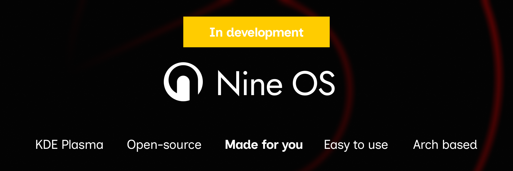

# Nine OS

  

  <b>A modern Arch-based Linux distribution focused on stability, reliability and broad hardware support.</b>

---

# ⚠️ UNDER DEVELOPMENT ⚠️

 This project is under development. Expect instability, bugs, glitches and do not use as your main os. We do not release any version for now, feel free to compile yourself or modify. We will release the installer iso soon. 

---

## 📖 About

**Nine OS** is an operating system based on Arch Linux and powered by KDE Plasma.

The project was created with a simple goal: provide an operating system that combines the flexibility of Arch Linux with the stability and reliability required for everyday use.

Whether you're a developer, student, gamer or casual user, Nine OS aims to deliver a smooth and dependable desktop experience.

---

## 🎯 Main Goals

* 🛡️ Stability for daily use
* ⚡ Reliable performance
* 💻 Support for a wide range of hardware
* 🎨 Modern KDE Plasma desktop environment
* 🔧 Easy maintenance and updates
* 📦 Access to the Arch Linux ecosystem

---

## 🖥️ Desktop Environment

Nine OS uses **KDE Plasma**, providing:

* Modern and customizable interface
* Lightweight resource usage
* Advanced personalization options
* Native Wayland and X11 support
* Integration with modern Linux technologies

---

## 🚀 Features

* Based on Arch Linux
* KDE Plasma desktop
* Optimized default configuration
* Regular updates
* Improved out-of-the-box experience
* Designed for both new and advanced Linux users

---

## 📦 Installation

Installation instructions will be available soon.

---

## 🤝 Contributing

Contributions are welcome.

If you'd like to help improve Nine OS:

1. Fork the repository
2. Create a feature branch
3. Commit your changes
4. Open a Pull Request

---

## 📜 License

This project is distributed under its respective license. See the repository files for more information.

---

  Made with ❤️ by the Nine OS Project

